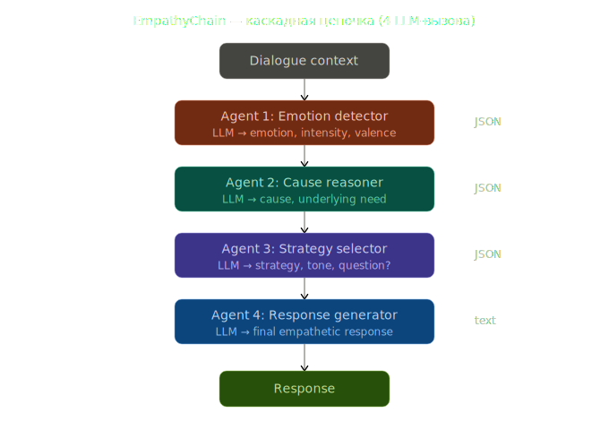
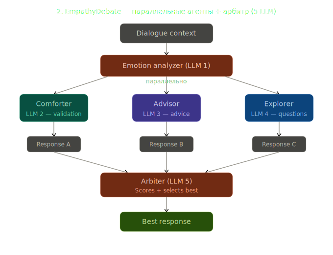
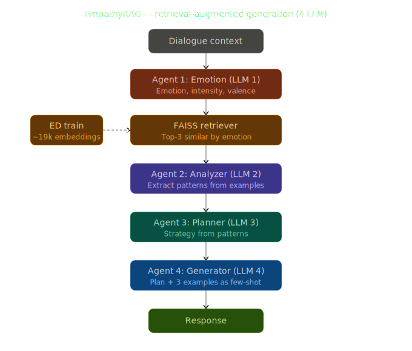
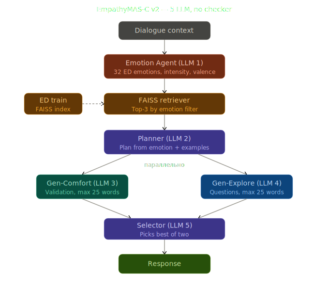

# Empathy Multiagent

Мультиагентные архитектуры для генерации эмпатичных ответов.
Бенчмарк: **EmpatheticDialogues** (Rashkin et al., 2019), test split (~2 547 диалогов, 32 эмоции).

---

## Структура проекта

```
v2_vkr/
├── architectures/                  # SVG-схемы архитектур
│   ├── empathy_chain_diagram_v2.svg
│   ├── empathy_debate_diagram.svg
│   ├── empathy_loop_diagram_v2.svg
│   ├── empathy_rag_diagram_v2.svg
│   └── empathy_mas_c_v2.svg
│
└── empathy_multiagent/
    ├── .env                        # API ключи (НЕ в git!)
    ├── .env.example                # Шаблон для .env
    ├── run_experiment.py           # Главный скрипт запуска
    ├── build_index.py              # Построение FAISS-индекса (для RAG/MAS-C)
    ├── requirements.txt
    │
    ├── src/                        # Основные модули
    │   ├── config.py               # MODEL_REGISTRY — все доступные модели
    │   ├── llm_factory.py          # Универсальный LLM-клиент (OpenAI-compatible)
    │   ├── load_dataset.py         # Загрузка EmpatheticDialogues
    │   ├── metrics.py              # BLEU, ROUGE, BERTScore, Distinct, Accuracy
    │   ├── emotion_classifier.py   # Вспомогательный классификатор эмоций
    │   └── fixed_few_shot.py       # Фиксированные few-shot примеры
    │
    ├── architectures/
    │   ├── empathy_zero_shot.py    # Baseline: прямой вызов (1 вызов)
    │   ├── empathy_few_shot.py     # Baseline: 3 случайных примера (1 вызов)
    │   ├── empathy_ektc.py         # Baseline: EKTC pipeline (2–4 вызова)
    │   ├── empathy_chain.py        # Каскадная цепочка (4 вызова)
    │   ├── empathy_debate.py       # Параллельные агенты + арбитр (5 вызовов)
    │   ├── empathy_loop.py         # Итеративная рефинация (5–11 вызовов)
    │   ├── empathy_rag.py          # RAG + анализ примеров (3 вызова)
    │   └── empathy_mas_c.py        # RAG + Planner + 2×Gen + Selector (5 вызовов)
    │
    ├── analysis/
    │   ├── compare_results.py      # Сводная таблица и графики по всем outputs/
    │   └── recompute_metrics.py    # Пересчёт метрик без повторного запуска
    │
    ├── retriever_cache/            # Кэш FAISS-индекса (создаётся автоматически)
    └── outputs/                    # Результаты экспериментов (создаётся автоматически)
        ├── <model>_<arch>.json
        ├── summary.csv
        └── comparison.png
```

---

## Быстрый старт

### 1. Установка зависимостей

```bash
cd empathy_multiagent
pip install -r requirements.txt
```

Для BERTScore нужен PyTorch. Если GPU нет — используй `--no-bertscore` (см. ниже).

Для архитектур с RAG (`empathy_rag`, `empathy_mas_c`) нужны дополнительные зависимости:

```bash
pip install sentence-transformers faiss-cpu
```

### 2. Настройка API ключей

```bash
cp .env.example .env
```

Открой `.env` и вставь ключи нужных провайдеров.
**Для старта достаточно только `GROQ_API_KEY`** — даёт доступ к `llama-3.1-8b`, `llama-3.3-70b`, `qwen-3-32b`.

Получить Groq API key бесплатно: [https://console.groq.com](https://console.groq.com) → API Keys.

### 3. Проверка подключения

```bash
cd empathy_multiagent
python -c "
from src.llm_factory import LLMFactory
import asyncio
llm = LLMFactory('llama-3.1-8b')
print(asyncio.run(llm.generate('You are helpful.', 'Say hello in one word.')))
"
```

---

## Запуск экспериментов

### Синтаксис

```bash
cd empathy_multiagent
python run_experiment.py --model <MODEL> --arch <ARCH> [--limit N] [--no-bertscore]
```

| Аргумент | Описание | Пример |
|---|---|---|
| `--model` | Ключ модели из `src/config.py` | `llama-3.1-8b` |
| `--arch` | Архитектура | `empathy_chain` |
| `--limit N` | Сколько диалогов прогнать (по умолчанию — все ~2547) | `--limit 50` |
| `--no-bertscore` | Пропустить BERTScore (быстрее, не нужен GPU) | флаг |

### Примеры

```bash
# Быстрый тест — убедиться, что всё работает
python run_experiment.py --model llama-3.1-8b --arch empathy_chain --limit 10 --no-bertscore

# Отладка на 50 диалогах
python run_experiment.py --model llama-3.1-8b --arch empathy_chain --limit 50
python run_experiment.py --model llama-3.1-8b --arch empathy_debate --limit 50
python run_experiment.py --model llama-3.1-8b --arch empathy_loop --limit 50
python run_experiment.py --model llama-3.1-8b --arch empathy_rag --limit 50
python run_experiment.py --model llama-3.1-8b --arch empathy_mas_c --limit 50

# Полный прогон на всех 2547 диалогах
python run_experiment.py --model llama-3.1-8b --arch empathy_chain
python run_experiment.py --model llama-3.1-8b --arch empathy_debate
python run_experiment.py --model llama-3.1-8b --arch empathy_loop
python run_experiment.py --model llama-3.1-8b --arch empathy_rag
python run_experiment.py --model llama-3.1-8b --arch empathy_mas_c

# Без BERTScore (если нет GPU)
python run_experiment.py --model llama-3.1-8b --arch empathy_chain --no-bertscore

# Другая модель
python run_experiment.py --model qwen-3-32b --arch empathy_chain --limit 100
```

### Прогнать все комбинации (bash)

```bash
for model in llama-3.1-8b qwen-3-32b llama-3.3-70b mistral-small gpt-4o-mini; do
  for arch in empathy_chain empathy_debate empathy_loop empathy_rag empathy_mas_c; do
    python run_experiment.py --model $model --arch $arch --no-bertscore
  done
done
```

---

## Анализ результатов

```bash
cd empathy_multiagent
python analysis/compare_results.py
```

Выводит таблицу в консоль, сохраняет `outputs/summary.csv` и `outputs/comparison.png` (по 2 метрики в строке, сгруппированы по архитектурам).

### Пересчёт метрик без повторного запуска

```bash
# Пересчитать все файлы в outputs/
python analysis/recompute_metrics.py

# Без BERTScore
python analysis/recompute_metrics.py --no-bertscore

# Конкретные файлы
python analysis/recompute_metrics.py --files outputs/llama-3.1-8b_empathy_chain.json
```

---

## Архитектуры

### EmpathyChain — каскадная цепочка (4 LLM-вызова)



| Этап | Агент | Что делает |
|---|---|---|
| 1 | **Emotion Agent** | Определяет эмоцию, интенсивность и валентность говорящего |
| 2 | **Cause Agent** | Выявляет конкретное событие-причину и главную потребность (`validation / comfort / advice / encouragement / space_to_vent`) |
| 3 | **Strategy Agent** | Выбирает стратегию ответа, тон и нужно ли заканчивать вопросом |
| 4 | **Generator** | Генерирует финальный эмпатичный ответ по плану (≤15 слов) |

---

### EmpathyDebate — параллельные агенты + арбитр (5 LLM-вызовов)



| Этап | Агент | Что делает |
|---|---|---|
| 1 | **Emotion Agent** | Определяет эмоцию — общий контекст для всех агентов |
| 2a | **Comforter** | Генерирует ответ с фокусом на валидацию чувств |
| 2b | **Advisor** | Генерирует ответ с мягкой сменой перспективы |
| 2c | **Explorer** | Генерирует ответ с вопросом для углублённого слушания |
| 3 | **Arbiter** | Оценивает все три ответа по 4 критериям (empathy / relevance / naturalness / helpfulness), выбирает лучший |

---

### EmpathyLoop — итеративная рефинация (5–11 LLM-вызовов)



| Этап | Агент | Что делает |
|---|---|---|
| 1 | **Planner** | Составляет план: эмоция, причина, потребность, стратегия, ключевые точки |
| 2 | **Generator** | Генерирует ответ по плану |
| 3a | **Empathy Validator** | Оценивает ответ по эмпатии (1–5), pass ≥ 4 |
| 3b | **Coherence Validator** | Оценивает релевантность и уместность длины (1–5), pass ≥ 4 |
| 3c | **Safety Validator** | Проверяет на вредоносность, токсичную позитивность, клише (1–5), pass ≥ 4 |
| — | **Refiner** | Если хоть один валидатор не прошёл — улучшает ответ по фидбэку (до 3 итераций) |

---

### EmpathyRAG — retrieval-augmented generation (3 LLM-вызова)



| Этап | Агент | Что делает |
|---|---|---|
| 1 | **Emotion Classifier** | Определяет эмоцию, интенсивность и валентность |
| 2 | **FAISS Retriever** | Ищет top-3 похожих диалога из train-сплита с той же эмоцией (без LLM, косинусное сходство) |
| 3 | **Example Analyzer** | Извлекает паттерны из найденных примеров: стратегия, тон, эффективные зачины |
| 4 | **Generator** | Генерирует ответ, используя примеры как few-shot и паттерны как руководство |

> При первом запуске строится FAISS-индекс по ~19 533 диалогам из train (~2 мин), затем кэшируется в `retriever_cache/`.

---

### EmpathyMAS-C — комбинированная мультиагентная система (5 LLM-вызовов)



| Этап | Агент | Что делает |
|---|---|---|
| 1 | **Emotion Agent** | Определяет эмоцию говорящего |
| 2 | **FAISS Retriever** | Ищет top-3 схожих примера по эмоции из train-сплита (без LLM) |
| 3 | **Planner** | Создаёт план ответа с опорой на retrieved примеры как контекст |
| 4a | **Gen-Comfort** | Генерирует ответ с акцентом на поддержку и валидацию чувств |
| 4b | **Gen-Explore** | Генерирует ответ с акцентом на любопытство и вовлечение (параллельно с 4a) |
| 5 | **Selector** | Выбирает лучший ответ исходя из типа эмоции (негативные → comfort, позитивные → explore) |

---

## Доступные модели

| Ключ (`--model`) | Провайдер | Размер | Лимиты (бесплатно) | Нужен ключ |
|---|---|---|---|---|
| `llama-3.1-8b` | Groq | 8B | 30 RPM / 14 400 RPD | `GROQ_API_KEY` |
| `qwen-3-32b` | Groq | 32B | 30 RPM / 14 400 RPD | `GROQ_API_KEY` |
| `llama-3.3-70b` | Groq | 70B | 30 RPM / 14 400 RPD | `GROQ_API_KEY` |
| `mistral-small` | Mistral API | 24B | 2 RPM / 1B токенов·мес | `MISTRAL_API_KEY` |
| `gpt-4o-mini` | GitHub Models | ~8B | 10 RPM / 150 RPD | `GITHUB_TOKEN` |

Закомментированные модели (раскомментировать в `src/config.py`): `llama-3.3-70b-cerebras`, `gemini-2.5-flash`, `gemini-2.5-pro`, `deepseek-v3`, `qwen-2.5-7b/14b/32b`.

---

## Метрики

| Метрика | Описание |
|---|---|
| BLEU-1/2/3/4 | N-gram precision ×100, сглаживание method1 |
| ROUGE-1/2/L | F1 overlap ×100 |
| BERTScore-P/R/F | Семантическое сходство (roberta-large), 6 знаков после запятой |
| Dist-1/2 | Лексическое разнообразие ответов ×100 |
| AvgLen | Средняя длина ответа (слов) |
| Accuracy (%) | Точность определения эмоции (только для архитектур с emotion agent) |
| Avg calls/example | Среднее число LLM-вызовов на диалог |
| Avg latency ms | Среднее время генерации на диалог |
| Errors | Число упавших примеров |
| Avg retrieval similarity | Среднее косинусное сходство retrieved примеров (только RAG/MAS-C) |
| Response novelty | 1 − max BLEU с retrieved примерами (только RAG/MAS-C) |

---

## Оценка затрат (Groq, бесплатный tier)

| Архитектура | Вызовов/диалог | Всего (2 547 диал.) | Время (30 RPM) |
|---|---|---|---|
| empathy_chain | 4 | 10 188 | ~6 ч |
| empathy_debate | 5 | 12 735 | ~7 ч |
| empathy_loop | 5–11 (ср. ~7) | ~17 829 | ~10 ч |
| empathy_rag | 3 | 7 641 | ~4 ч |
| empathy_mas_c | 5 | 12 735 | ~7 ч |

Groq: 14 400 RPD — при превышении суточного лимита запуск автоматически продолжится на следующий день.
Рекомендация: начни с `--limit 50`, затем `--limit 500`, потом полный прогон.

---

## Добавить новую модель

В `src/config.py` добавить запись в `MODEL_REGISTRY`:

```python
"my-model": {
    "base_url": "https://api.example.com/v1",
    "model": "exact-model-name-on-provider",
    "api_key_env": "MY_API_KEY",
    "provider": "example",
    "size": "7B",
    "max_rpm": 30,
    "max_rpd": 10000,
    "notes": "описание",
},
```

Затем: `python run_experiment.py --model my-model --arch empathy_chain --limit 10`
