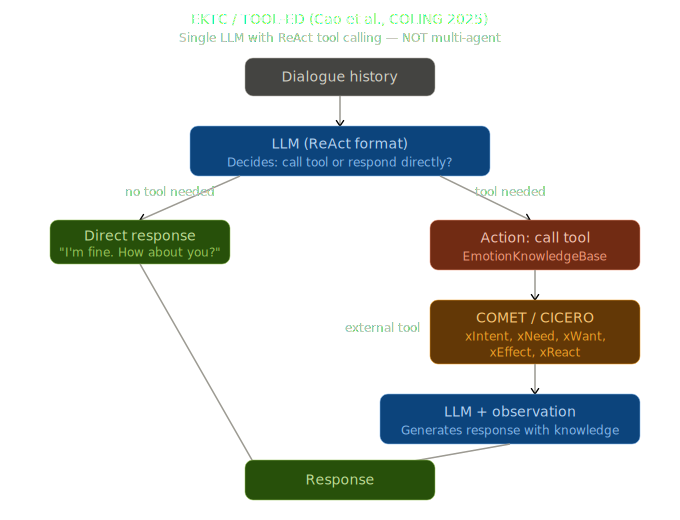
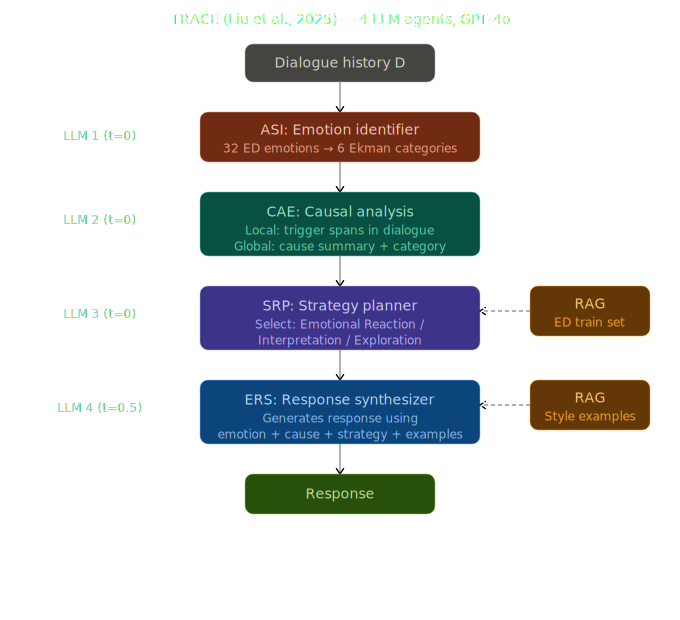

# Empathy Multiagent

Мультиагентные архитектуры для генерации эмпатичных ответов.
Бенчмарк: **EmpatheticDialogues** (Rashkin et al., 2019), test split (~2 547 диалогов, 32 эмоции).

---

## Структура проекта

```
v2_vkr/
├── architectures/                  # SVG-схемы архитектур
│   ├── ektc_tool_ed_diagram.svg
│   ├── trace_architecture_diagram.svg
│   ├── empathy_chain_diagram_v2.svg
│   ├── empathy_debate_diagram.svg
│   ├── empathy_loop_diagram_v2.svg
│   ├── empathy_rag_diagram_v2.svg
│   └── empathy_mas_c_v2.svg
│
└── empathy_multiagent/
    ├── .env                        # API ключи (НЕ в git!)
    ├── .env.example                # Шаблон для .env
    ├── run_experiment.py           # Главный скрипт запуска
    ├── build_index.py              # Построение FAISS-индекса (для RAG/MAS-C/TRACE)
    ├── requirements.txt
    │
    ├── src/                        # Основные модули
    │   ├── config.py               # MODEL_REGISTRY — все доступные модели
    │   ├── llm_factory.py          # Универсальный LLM-клиент (OpenAI-compatible)
    │   ├── load_dataset.py         # Загрузка EmpatheticDialogues
    │   ├── metrics.py              # BLEU, ROUGE, BERTScore, Distinct, Accuracy
    │   ├── emotion_classifier.py   # Вспомогательный классификатор эмоций
    │   └── fixed_few_shot.py       # Фиксированные few-shot примеры
    │
    ├── architectures/
    │   ├── empathy_zero_shot.py    # Baseline: прямой вызов (1 вызов)
    │   ├── empathy_few_shot.py     # Baseline: 3 примера из train (1 вызов)
    │   ├── empathy_ektc.py         # Baseline: TOOL-ED/EKTC pipeline (2–4 вызова)
    │   ├── empathy_trace.py        # Baseline: TRACE (Liu et al., 2025) (4 вызова + RAG)
    │   ├── empathy_chain.py        # Каскадная цепочка (4 вызова)
    │   ├── empathy_debate.py       # Параллельные агенты + арбитр (5 вызовов)
    │   ├── empathy_loop.py         # Итеративная рефинация (5–11 вызовов)
    │   ├── empathy_rag.py          # RAG + анализ примеров (3 вызова)
    │   └── empathy_mas_c.py        # RAG + Planner + 2×Gen + Selector (5 вызовов)
    │
    ├── analysis/
    │   ├── compare_results.py      # Сводная таблица и графики по всем outputs/
    │   ├── recompute_metrics.py    # Пересчёт метрик без повторного запуска
    │   └── plot_architectures.py   # Рисует блок-диаграммы всех архитектур
    │
    ├── retriever_cache/            # Кэш FAISS-индекса (создаётся автоматически)
    └── outputs/                    # Результаты экспериментов (создаётся автоматически)
        ├── <model>_<arch>.json
        ├── summary.csv
        └── comparison.png
```

---

## Быстрый старт

### 1. Установка зависимостей

```bash
cd empathy_multiagent
pip install -r requirements.txt
```

Для BERTScore нужен PyTorch. Если GPU нет — используй `--no-bertscore` (см. ниже).

Для архитектур с RAG (`empathy_rag`, `empathy_mas_c`) нужны дополнительные зависимости:

```bash
pip install sentence-transformers faiss-cpu
```

### 2. Настройка API ключей

```bash
cp .env.example .env
```

Открой `.env` и вставь ключи нужных провайдеров.
**Для старта достаточно только `GROQ_API_KEY`** — даёт доступ к `llama-3.1-8b`, `llama-3.3-70b`, `qwen-3-32b`.

Получить Groq API key бесплатно: [https://console.groq.com](https://console.groq.com) → API Keys.

### 3. Проверка подключения

```bash
cd empathy_multiagent
python -c "
from src.llm_factory import LLMFactory
import asyncio
llm = LLMFactory('llama-3.1-8b')
print(asyncio.run(llm.generate('You are helpful.', 'Say hello in one word.')))
"
```

---

## Запуск экспериментов

### Синтаксис

```bash
cd empathy_multiagent
python run_experiment.py --model <MODEL> --arch <ARCH> [--limit N] [--no-bertscore]
```

| Аргумент | Описание | Пример |
|---|---|---|
| `--model` | Ключ модели из `src/config.py` | `llama-3.1-8b` |
| `--arch` | Архитектура | `empathy_chain` |
| `--limit N` | Сколько диалогов прогнать (по умолчанию — все ~2547) | `--limit 50` |
| `--no-bertscore` | Пропустить BERTScore (быстрее, не нужен GPU) | флаг |

### Примеры

```bash
# Быстрый тест — убедиться, что всё работает
python run_experiment.py --model llama-3.1-8b --arch empathy_chain --limit 10 --no-bertscore

# Отладка на 50 диалогах
python run_experiment.py --model llama-3.1-8b --arch empathy_zero_shot --limit 50
python run_experiment.py --model llama-3.1-8b --arch empathy_few_shot --limit 50
python run_experiment.py --model llama-3.1-8b --arch empathy_ektc --limit 50
python run_experiment.py --model llama-3.1-8b --arch empathy_trace --limit 50
python run_experiment.py --model llama-3.1-8b --arch empathy_chain --limit 50
python run_experiment.py --model llama-3.1-8b --arch empathy_debate --limit 50
python run_experiment.py --model llama-3.1-8b --arch empathy_loop --limit 50
python run_experiment.py --model llama-3.1-8b --arch empathy_rag --limit 50
python run_experiment.py --model llama-3.1-8b --arch empathy_mas_c --limit 50

# Полный прогон на всех 2547 диалогах
python run_experiment.py --model llama-3.1-8b --arch empathy_zero_shot
python run_experiment.py --model llama-3.1-8b --arch empathy_few_shot
python run_experiment.py --model llama-3.1-8b --arch empathy_ektc
python run_experiment.py --model llama-3.1-8b --arch empathy_trace
python run_experiment.py --model llama-3.1-8b --arch empathy_chain
python run_experiment.py --model llama-3.1-8b --arch empathy_debate
python run_experiment.py --model llama-3.1-8b --arch empathy_loop
python run_experiment.py --model llama-3.1-8b --arch empathy_rag
python run_experiment.py --model llama-3.1-8b --arch empathy_mas_c

# Без BERTScore (если нет GPU)
python run_experiment.py --model llama-3.1-8b --arch empathy_chain --no-bertscore

# Другая модель
python run_experiment.py --model qwen-3-32b --arch empathy_chain --limit 100
```

### Прогнать все комбинации (bash)

```bash
for model in llama-3.1-8b qwen-3-32b llama-3.3-70b mistral-small gpt-4o-mini; do
  for arch in empathy_zero_shot empathy_few_shot empathy_ektc empathy_trace empathy_chain empathy_debate empathy_loop empathy_rag empathy_mas_c; do
    python run_experiment.py --model $model --arch $arch --no-bertscore
  done
done
```

---

## Анализ результатов

```bash
cd empathy_multiagent
python analysis/compare_results.py
```

Выводит таблицу в консоль, сохраняет `outputs/summary.csv` и `outputs/comparison.png` (по 2 метрики в строке, сгруппированы по архитектурам).

### Пересчёт метрик без повторного запуска

```bash
# Пересчитать все файлы в outputs/
python analysis/recompute_metrics.py

# Без BERTScore
python analysis/recompute_metrics.py --no-bertscore

# Конкретные файлы
python analysis/recompute_metrics.py --files outputs/llama-3.1-8b_empathy_chain.json
```

---

## Архитектуры

### Бейзлайны

---

#### Zero-Shot — прямой вызов (1 LLM-вызов)

Один вызов LLM с системным промптом из EKTC/TOOL-ED (Rashkin et al. + Liu et al.). Модель отвечает как Listener без каких-либо промежуточных шагов.

| Этап | Что делает |
|---|---|
| 1 | **LLM** получает диалог и системный промпт с описанием задачи, генерирует эмпатичный ответ напрямую |

---

#### Few-Shot — с примерами из train (1 LLM-вызов)

Расширяет Zero-Shot: в системный промпт добавляются 3 случайных примера из train-сплита с ответами Listener как демонстрации желаемого стиля.

| Этап | Что делает |
|---|---|
| 1 | **Sampler** выбирает 3 случайных примера из train (последние 3 реплики контекста + gold response) |
| 2 | **LLM** генерирует ответ, используя примеры как few-shot в промпте |

---

#### EKTC / TOOL-ED — tool-calling pipeline (2–4 LLM-вызова)



Реализация на основе статьи **"TOOL-ED: Enhancing Empathetic Response Generation with the Tool Calling Capability of LLM"** (COLING 2025). Ключевая идея: LLM сам решает нужно ли внешнее знание, а Reflector фильтрует нерелевантные факты. Вместо COMET-модели знание генерируется самим LLM.

| Этап | Агент | Что делает |
|---|---|---|
| 1 | **Annotator** | Оценивает эмоциональную интенсивность (low/medium/high) и решает, нужно ли обращаться к EmotionKnowledgeBase (`use_tool: true/false`) |
| 2 *(если use_tool)* | **KnowledgeGen** | Генерирует commonsense-знание по 5 отношениям: xIntent, xNeed, xWant, xEffect, xReact (заменяет COMET из оригинала) |
| 3 *(если use_tool)* | **Reflector** | Проверяет знание по 3 критериям консистентности, фильтрует нерелевантные факты |
| 4 | **Generator** | Генерирует ответ — с отфильтрованным знанием (high intensity) или без (low) |

> При `emotional_intensity = low` пропускает шаги 2–3 и делает только 2 LLM-вызова (Annotator + Generator).

---

#### TRACE — (Liu et al., 2025 · arXiv:2509.21849) (4 LLM-вызова + RAG)



Реализация архитектуры из статьи **"TRACE: A Multi-Agent Framework for Empathetic Dialogue Response Generation"** (2025). Линейный пайплайн из 4 специализированных агентов с RAG на шагах 3 и 4.

| Этап | Агент | Что делает |
|---|---|---|
| 1 | **ASI** (Affective State Identifier) | Классифицирует эмоцию в одну из 6 категорий Экмана (happiness / sadness / anger / fear / disgust / surprise), маппируя 32 fine-grained эмоции ED |
| 2 | **CAE** (Causal Analysis Engine) | Dual-granularity анализ: извлекает trigger spans (конкретные реплики-триггеры) + global_cause_summary + cause_category (6 психологических категорий) |
| 3 | **SRP** (Strategic Response Planner) + RAG | Выбирает одну из трёх стратегий EPITOME: **ER** (Emotional Reaction), **IP** (Interpretation), **EX** (Exploration). RAG подаёт 2 похожих примера из train как референс |
| 4 | **ERS** (Empathetic Response Synthesizer) + RAG | Генерирует ответ: обязательно вплетает конкретную деталь из trigger spans, блендирует primary и secondary стратегии |

> RAG использует тот же FAISS-индекс что и EmpathyRAG/MAS-C. Precise search по Ekman-группе, fuzzy fallback по всему корпусу.

---

### Мультиагентные архитектуры

### EmpathyChain — каскадная цепочка (4 LLM-вызова)


| Этап | Агент | Что делает |
|---|---|---|
| 1 | **Emotion Agent** | Определяет эмоцию, интенсивность и валентность говорящего |
| 2 | **Cause Agent** | Выявляет конкретное событие-причину и главную потребность (`validation / comfort / advice / encouragement / space_to_vent`) |
| 3 | **Strategy Agent** | Выбирает стратегию ответа, тон и нужно ли заканчивать вопросом |
| 4 | **Generator** | Генерирует финальный эмпатичный ответ по плану (≤15 слов) |

---

### EmpathyDebate — параллельные агенты + арбитр (5 LLM-вызовов)


| Этап | Агент | Что делает |
|---|---|---|
| 1 | **Emotion Agent** | Определяет эмоцию — общий контекст для всех агентов |
| 2a | **Comforter** | Генерирует ответ с фокусом на валидацию чувств |
| 2b | **Advisor** | Генерирует ответ с мягкой сменой перспективы |
| 2c | **Explorer** | Генерирует ответ с вопросом для углублённого слушания |
| 3 | **Arbiter** | Оценивает все три ответа по 4 критериям (empathy / relevance / naturalness / helpfulness), выбирает лучший |

---

### EmpathyLoop — итеративная рефинация (5–11 LLM-вызовов)


| Этап | Агент | Что делает |
|---|---|---|
| 1 | **Planner** | Составляет план: эмоция, причина, потребность, стратегия, ключевые точки |
| 2 | **Generator** | Генерирует ответ по плану |
| 3a | **Empathy Validator** | Оценивает ответ по эмпатии (1–5), pass ≥ 4 |
| 3b | **Coherence Validator** | Оценивает релевантность и уместность длины (1–5), pass ≥ 4 |
| 3c | **Safety Validator** | Проверяет на вредоносность, токсичную позитивность, клише (1–5), pass ≥ 4 |
| — | **Refiner** | Если хоть один валидатор не прошёл — улучшает ответ по фидбэку (до 3 итераций) |

---

### EmpathyRAG — retrieval-augmented generation (3 LLM-вызова)


| Этап | Агент | Что делает |
|---|---|---|
| 1 | **Emotion Classifier** | Определяет эмоцию, интенсивность и валентность |
| 2 | **FAISS Retriever** | Ищет top-3 похожих диалога из train-сплита с той же эмоцией (без LLM, косинусное сходство) |
| 3 | **Example Analyzer** | Извлекает паттерны из найденных примеров: стратегия, тон, эффективные зачины |
| 4 | **Generator** | Генерирует ответ, используя примеры как few-shot и паттерны как руководство |

> При первом запуске строится FAISS-индекс по ~19 533 диалогам из train (~2 мин), затем кэшируется в `retriever_cache/`.

---

### EmpathyMAS-C — комбинированная мультиагентная система (5 LLM-вызовов)


| Этап | Агент | Что делает |
|---|---|---|
| 1 | **Emotion Agent** | Определяет эмоцию говорящего |
| 2 | **FAISS Retriever** | Ищет top-3 схожих примера по эмоции из train-сплита (без LLM) |
| 3 | **Planner** | Создаёт план ответа с опорой на retrieved примеры как контекст |
| 4a | **Gen-Comfort** | Генерирует ответ с акцентом на поддержку и валидацию чувств |
| 4b | **Gen-Explore** | Генерирует ответ с акцентом на любопытство и вовлечение (параллельно с 4a) |
| 5 | **Selector** | Выбирает лучший ответ исходя из типа эмоции (негативные → comfort, позитивные → explore) |

---

## Доступные модели

| Ключ (`--model`) | Провайдер | Размер | Лимиты (бесплатно) | Нужен ключ |
|---|---|---|---|---|
| `llama-3.1-8b` | Groq | 8B | 30 RPM / 14 400 RPD | `GROQ_API_KEY` |
| `qwen-3-32b` | Groq | 32B | 30 RPM / 14 400 RPD | `GROQ_API_KEY` |
| `llama-3.3-70b` | Groq | 70B | 30 RPM / 14 400 RPD | `GROQ_API_KEY` |
| `mistral-small` | Mistral API | 24B | 2 RPM / 1B токенов·мес | `MISTRAL_API_KEY` |
| `gpt-4o-mini` | GitHub Models | ~8B | 10 RPM / 150 RPD | `GITHUB_TOKEN` |

Закомментированные модели (раскомментировать в `src/config.py`): `llama-3.3-70b-cerebras`, `gemini-2.5-flash`, `gemini-2.5-pro`, `deepseek-v3`, `qwen-2.5-7b/14b/32b`.

---

## Метрики

| Метрика | Описание |
|---|---|
| BLEU-1/2/3/4 | N-gram precision ×100, сглаживание method1 |
| ROUGE-1/2/L | F1 overlap ×100 |
| BERTScore-P/R/F | Семантическое сходство (roberta-large), 6 знаков после запятой |
| Dist-1/2 | Лексическое разнообразие ответов ×100 |
| AvgLen | Средняя длина ответа (слов) |
| Accuracy (%) | Точность определения эмоции (только для архитектур с emotion agent) |
| Avg calls/example | Среднее число LLM-вызовов на диалог |
| Avg latency ms | Среднее время генерации на диалог |
| Errors | Число упавших примеров |
| Avg retrieval similarity | Среднее косинусное сходство retrieved примеров (только RAG/MAS-C) |
| Response novelty | 1 − max BLEU с retrieved примерами (только RAG/MAS-C) |

---

## Оценка затрат (Groq, бесплатный tier)

| Архитектура | Вызовов/диалог | Всего (2 547 диал.) | Время (30 RPM) |
|---|---|---|---|
| empathy_zero_shot | 1 | 2 547 | ~1.5 ч |
| empathy_few_shot | 1 | 2 547 | ~1.5 ч |
| empathy_ektc | 2–4 (ср. ~3) | ~7 641 | ~4 ч |
| empathy_trace | 4 | 10 188 | ~6 ч |
| empathy_chain | 4 | 10 188 | ~6 ч |
| empathy_debate | 5 | 12 735 | ~7 ч |
| empathy_loop | 5–11 (ср. ~7) | ~17 829 | ~10 ч |
| empathy_rag | 3 | 7 641 | ~4 ч |
| empathy_mas_c | 5 | 12 735 | ~7 ч |

Groq: 14 400 RPD — при превышении суточного лимита запуск автоматически продолжится на следующий день.
Рекомендация: начни с `--limit 50`, затем `--limit 500`, потом полный прогон.

---

## Результаты экспериментов

Полный прогон на ~2 547 тестовых диалогах EmpatheticDialogues. Таблица отсортирована по модели, внутри — по убыванию BERTScore-F.

### LLaMA-3.1-8B (Groq)

| Архитектура | BLEU-1 | ROUGE-L | BERTScore-F | Dist-2 | AvgLen | Accuracy | Вызовов |
|---|---|---|---|---|---|---|---|
| **empathy_mas_c** | **13.48** | 8.35 | **0.865972** | 74.58 | 14.0 | 45% | 5.0 |
| empathy_rag | 12.70 | 10.24 | 0.865505 | 76.22 | 21.3 | 45% | 3.0 |
| empathy_chain | **13.74** | 9.44 | 0.865408 | 74.53 | 17.2 | 45% | 4.0 |
| empathy_debate | 11.62 | 7.40 | 0.863599 | 80.32 | 16.6 | 45% | 5.0 |
| empathy_few_shot | 12.36 | 9.23 | 0.863377 | 71.94 | 22.9 | — | 1.0 |
| empathy_loop | 12.04 | 7.12 | 0.862719 | 73.76 | 16.8 | — | 11.0 |
| empathy_trace | 12.23 | 9.80 | 0.862580 | 80.37 | 19.0 | — | 4.0 |
| empathy_zero_shot | 10.80 | 10.12 | 0.859369 | 70.84 | 34.0 | — | 1.0 |
| empathy_ektc | 9.22 | 8.82 | 0.856792 | 66.48 | 41.2 | — | 3.7 |

### Mistral-Small-24B (Mistral API)

| Архитектура | BLEU-1 | ROUGE-L | BERTScore-F | Dist-2 | AvgLen | Accuracy | Вызовов |
|---|---|---|---|---|---|---|---|
| **empathy_rag** | **16.71** | **15.22** | **0.875017** | 83.48 | 15.4 | 65% | 3.0 |
| empathy_mas_c | 11.07 | 8.18 | 0.874101 | 84.66 | 7.8 | 65% | 5.0 |
| empathy_chain | 9.19 | 6.00 | 0.871318 | 78.95 | 8.0 | 65% | 4.0 |
| empathy_few_shot | 12.25 | 8.81 | 0.869581 | 79.79 | 12.8 | — | 1.0 |
| empathy_loop | 11.26 | 8.52 | 0.867912 | 77.01 | 8.9 | — | 11.6 |
| empathy_trace | 12.59 | 8.83 | 0.867507 | **87.20** | 10.0 | — | 4.0 |
| empathy_debate | 8.23 | 5.31 | 0.867487 | 85.31 | 8.1 | 65% | 5.0 |
| empathy_zero_shot | 10.73 | 8.87 | 0.866301 | 80.04 | 20.9 | — | 1.0 |
| empathy_ektc | 9.49 | 8.34 | 0.858439 | 72.43 | 26.2 | — | 3.8 |

### Qwen-3-32B (Groq)

| Архитектура | BLEU-1 | ROUGE-L | BERTScore-F | Dist-2 | AvgLen | Accuracy | Вызовов |
|---|---|---|---|---|---|---|---|
| **empathy_mas_c** | 10.46 | 10.42 | **0.864296** | **85.75** | 15.8 | 60% | 5.0 |
| empathy_trace | 11.28 | 8.90 | 0.863908 | 83.60 | 13.6 | — | 4.0 |
| empathy_zero_shot | 11.03 | 9.99 | 0.863403 | 81.55 | 23.2 | — | 1.0 |
| empathy_chain | 9.14 | 8.38 | 0.862969 | 80.75 | 16.6 | 60% | 4.0 |
| empathy_few_shot | 10.46 | 9.94 | 0.862201 | 78.86 | 22.6 | — | 1.0 |
| empathy_rag | 10.02 | 10.78 | 0.861071 | 79.19 | 27.4 | 60% | 3.0 |
| empathy_debate | 10.37 | 9.78 | 0.859371 | 78.35 | 19.7 | 55% | 5.0 |
| empathy_loop | 9.50 | 8.16 | 0.859351 | 77.20 | 18.6 | — | 8.0 |
| empathy_ektc | 9.32 | 8.62 | 0.855369 | 74.03 | 32.3 | — | 3.9 |

---

## Выводы

### 1. EmpathyMAS-C лидирует у 2 из 3 моделей
`empathy_mas_c` занял первое место по BERTScore-F у LLaMA-3.1-8B (0.8660) и Qwen-3-32B (0.8643). Комбинация RAG (семантически близкие примеры) + структурированный Planner + параллельная генерация двух стилей (comfort vs explore) + целевой Selector даёт устойчивое преимущество. Система не просто генерирует ответ — она подбирает стратегию под тип эмоции.

### 2. EmpathyRAG выигрывает у Mistral-Small с большим отрывом
У Mistral `empathy_rag` показал рекордные результаты: BERTScore-F 0.8750, BLEU-1 16.71, ROUGE-L 15.22. Причина: Mistral точнее следует инструкциям, и retrieved примеры дают сильный стилистический сигнал. Когда модель умеет «слушать» few-shot примеры — RAG становится мощнейшим инструментом.

### 3. EKTC стабильно худший, несмотря на сложность
`empathy_ektc` занял последнее место у всех трёх моделей. Причина — длина ответов: 26–41 слово против gold-ответов в 8–15 слов. Commonsense knowledge (xIntent, xNeed, xWant...) смещает модель в сторону развёрнутых объяснений, которые расходятся с лаконичным стилем ED. Сложный pipeline (3–4 вызова) не компенсирует это смещение.

### 4. Zero-Shot лучше EKTC — «меньше» иногда лучше
Один вызов без промежуточных шагов (`empathy_zero_shot`) обгоняет `empathy_ektc` во всех трёх моделях. Это показывает, что добавление агентов оправдано только если они действительно контролируют качество ответа — а не просто генерируют дополнительный контекст, который потом игнорируется.

### 5. Длина ответа — ключевой фактор для n-gram метрик
Архитектуры с AvgLen 7–17 слов (MAS-C, Chain, Debate, Loop) показывают лучшие BLEU/ROUGE. Это объясняется тем, что gold-ответы в ED короткие и разговорные. Правило «максимум 15 слов» в промптах дало видимый эффект.

### 6. Mistral-Small превосходит LLaMA-8B и Qwen-32B
Несмотря на меньший публичный рейтинг, Mistral-Small-24B показал лучший абсолютный BERTScore-F (0.875 у `empathy_rag`) и лучшую Accuracy эмоций (65% vs 45–60%). Модель лучше следует сложным multi-step инструкциям и точнее классифицирует эмоции.

### 7. Qwen-3-32B немного проигрывает меньшим моделям
Qwen-3-32B показал BERTScore-F ниже LLaMA-8B несмотря на в 4 раза больший размер. Вероятная причина — остаточное влияние режима reasoning (thinking mode): модель генерирует более аналитичные, менее разговорные ответы, что расходится со стилем ED.

### 8. TRACE и EmpathyChain — сопоставимы
Оба пайплайна делают 4 LLM-вызова, оба включают анализ эмоции, причины и стратегии. BERTScore-F у них близок (~0.862–0.865 для LLaMA). TRACE дополнительно даёт RAG и Ekman-классификацию, что чуть повышает Dist-2 (разнообразие) но не даёт систематического преимущества по BERTScore — возможно потому что маппинг 32→6 эмоций теряет нюансы.

---

## Добавить новую модель

В `src/config.py` добавить запись в `MODEL_REGISTRY`:

```python
"my-model": {
    "base_url": "https://api.example.com/v1",
    "model": "exact-model-name-on-provider",
    "api_key_env": "MY_API_KEY",
    "provider": "example",
    "size": "7B",
    "max_rpm": 30,
    "max_rpd": 10000,
    "notes": "описание",
},
```

Затем: `python run_experiment.py --model my-model --arch empathy_chain --limit 10`
